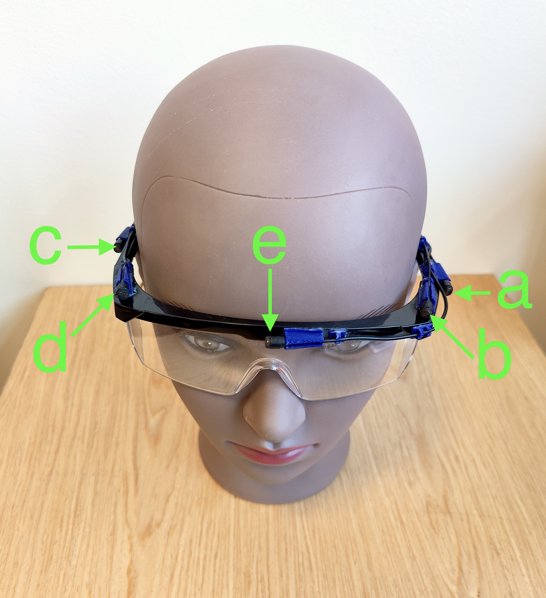

# Group in Noise (GiN) recordings

This repository contains useful tools and scripts to use with the Group in Noise (GiN) data. The GiN dataset contains over 2 hours of group conversations recorded in 3 noisy rooms using binaural microphones, a custom glasses-mounted microphone array, and close-talking microphones. Clock-synchronised head-pose data are also provided for every participant, as well as automatically generated VAD information.

## Downloading
The GiN data can be accessed [here](https://doi.org/10.14469/hpc/13463).

### Downloading on Mac OS
Make sure wget is installed
```bash
# on Mac OS
brew install wget
```
Then run the following in a terminal to download into `~/Downloads/GiNdata`
```bash
# download the data
filenames=("GiNdata.zip" "GiNdata.z01" "GiNdata.z02" "GiNdata.z03" "GiNdata.z04" "GiNdata.z05" "GiNdata.z06" "GiNdata.z07" "GiNdata.z08")
mkdir ${HOME}/Downloads/GiNdata/
for i in {2..10}; do wget -O ${HOME}/Downloads/GiNdata/${filenames[$i]} --continue "https://data.hpc.imperial.ac.uk/resolve/?doi=13463&file=$(printf "%01d" $i)&access=rqf7-7rw6"; done;
# unzip the archive
cd ${HOME}/Downloads/GiNdata
zip -s 0 GiNdata.zip --out unsplitGiNdata.zip; unzip unsplitGiNdata.zip
rm unsplitGiNdata.zip GiNdata.z*
```
### Downloading on Windows
Run the following in a Windows PowerShell to automatically download into `~\Downloads\GiNdata`.

```powershell
$downpath= $HOME + "\Downloads\GiNdata\";`
$dataurl= "https://data.hpc.imperial.ac.uk/resolve/?doi=13463";`
mkdir $downpath -ea 0;`
`
$filenames=@("GiNdata.zip", "GiNdata.z01", "GiNdata.z02", "GiNdata.z03", "GiNdata.z04", "GiNdata.z05", "GiNdata.z06", "GiNdata.z07", "GiNdata.z08");`
`
for ($i=2; $i -le 10; $i++){`
$infile="{0}&file={1}&access=EMBARGOED" -f $dataurl, $i;`
$outfile=$downpath+$filenames[$i-1];`
Write-Output $infile;`
Invoke-WebRequest $infile -OutFile $outfile;};`
`
cd $downpath;`
cmd /c copy /b $downPath"GiNdata.z*" $downPath"GiNdataunsplit.zip";`
unzip GiNdataunsplit.zip;`
rm GiN*.z*;
```


## Description
This dataset contains clock-synchronised multimedia recordings of conversations in noisy restaurant-like scenarios. It was recorded in three rooms in the Department of Electrical and Electronic Engineering at Imperial College London. In every recording session, 6 participants were seated around a table and held a conversation while noise was played through loudspeakers.

Every participant wore a custom headset equipped with a close-talking microphone and a pose tracker, as shown in Figure 1 (Left). In addition, one participant in each session wore binaural microphones and a pair of safety glasses mounted with microphones to provide egocentric audio data, as shown in Figure 1 (Right). The recordings session were monitored by one of the authors acting as a ‘waiter’, also wearing a custom headset. Each session was recorded by a fixed reference microphone placed in the centre of the table. 
<p float="none" align="middle">
  
   
</p>

> Figure 1: **(Left)** Custom headset mounted with an HTC VIVE Tracker 3.0 (A) and a DPA 4060 microphone (B). **(Right)** Custom safety glasses with 5 DPA 4060 microphones (a-e).


The 'waiter' guided the conversation, effectively dividing the recordings into 4 tasks. In *Task 1*, every participant was asked to read in turn a different snippet from Alice in Wonderland. *Task 2* was a group exercise in which the participants were asked to collectively agree on a holiday destination. In *Task 3*, the participants played the game ‘I spy’, in pairs with the person opposite them. In *Task 4*, they played the card game ‘Go Fish’ as a group. The general recording setup is shown in Figure 2. _Task 0_ corresponds to the waiter giving instructions to the participants.

<p float="none" align="middle">
  
</p>

> Figure 2: Diagram of the recording setup, not to scale. The 6 participants are shown with their respective speaker ID and the ‘waiter’ is labelled with number 7. Participant 3 is the ‘listener’, equipped with binaural microphones and custom glasses. The approximate loudspeaker locations are shown. The origin of the coordinate system is always located behind and to the left of participant 1 (bottom left corner in this view). The reference microphone is placed approximately at the centre of the table.
> 
## Overview of the data
The dataset contains the following data
- 7 channels of close-talking microphone recordings
- Head pose (position and orientation) for every participant
- A 7-channel array recording from glasses-mounted microphones and binaural microphones
- A single-channel recording from a reference microphone
- Voice Activity Detection data, automatically obtained using [Silero](https://github.com/snakers4/silero-vad)
- Timing information for each task in the conversation
- Loudspeakers position
- Acoustic Impulse Response for the glasses-mounted array


## Dataset structure
One or two recording sessions took place in each room, for a total of approximately 22 min per session. For ease of use, the data were cropped into 1 min segments and files were named with their time codes in the format `mm_ss_SSS`. For example, the file `room_403/reference_audio/session_1/03_00_000.wav` contains 1 min of audio data from the reference microphone for session 1 in room 403, starting at minute 3. The general dateset structure is as follows
<pre>
┬── <kbd>array_irs.h5</kbd> (<em>file</em>): full acoustic impulse response for the glasses array.
├── <kbd>array_irs_v2.h5</kbd> (<em>file</em>): cropped acoustic impulse response for the glasses array.
├── <b>room_ID</b> (<em>directory</em>): contains all the data for a given room.
│   ├── <b>array_audio</b> (<em>directory</em>): contains the array audio (glasses + binaural mics)
│   │   │  for the listener for all sessions in the room.
│   │   └── <b>session_#</b> (<em>directory</em>): the session directories for the array audio.
│   │       └── <kbd>##_##_###.wav</kbd> (<em>files</em>): 7-channel audio wav files.
│   ├── <b>close_talking_audio</b> (<em>directory</em>): contains the close-talking microphone
│   │   │  recordings for the 6 participants (not including the waiter) for
│   │   │  all sesssions in the room.
│   │   └── <b>session_#</b> (<em>directory</em>): the session directories for the close-talking audio.
│   │       └── <kbd>##_##_###.wav</kbd> (<em>files</em>): 6-channel audio wav files, with channels 1-6
│   │              corresponding to speakers 1-6.
│   ├── <b>metadata</b> (<em>directory</em>): contains relevant information about the room.
│   │   ├── <kbd>loudspeakers_tascar.txt</kbd> (<em>file</em>): loudspeaker position in right-hand, z-up
│   │   │      coordinate system used in Tascar.
│   │   └── <b>session_#</b> (<em>directory</em>): the session directories for metadata.
│   │       └── <kbd>tasktimings.csv</kbd> (<em>file</em>): csv file containing the timing information for
│   │              each of the task in the conversation.  
│   ├── <b>reference_audio</b> (<em>directory</em>): contains the audio from the reference microphone 
│   │   │  for all sessions in the room.
│   │   └── <b>session_#</b> (<em>directory</em>): the session directories for the reference microphone.
│   │       └── <kbd>##_##_###.wav</kbd> (<em>files</em>): single-channel wav files from the reference 
│   │              microphone.
│   ├── <b>tracked_data</b> (<em>directory</em>): contains head pose data (position and orientation) for
│   │   │  all participants and all sessions in the room, in a compact format.
│   │   └── <b>session_#</b> (<em>directory</em>): the session directories for head pose data.
│   │       └── <kbd>##_##_###.json</kbd> (<em>files</em>): JSON files containing the pose information
│   │              for each participant in Cartesian coordinates and Euler angles, with
│   │              the right-hand, z-up coordinate system used in Tascar.
│   ├── <b>tracked_data_tascar</b> (<em>directory</em>): contains head pose data for all participants
│   │   │  and all sessions in the room, in a format ready to use with Tascar.
│   │   └── <b>session_#</b> (<em>directory</em>): the session directories for head pose data.
│   │       ├── <kbd>##_##_###_speaker#_position.csv</kbd> (<em>files</em>): csv files containing Cartesian
│   │       │      coordinates for each participant.         
│   │       └── <kbd>##_##_###_speaker#_rotation.csv</kbd> (<em>files</em>): csv files containing Euler angles
│   │              for each participant.    
│   ├── <b>vad_data</b> (<em>directory</em>): contains automatically generated VAD data for the
│   │   │  close-talking microphones (including the waiter) for all sessions in the room.
│   │   └── <b>session_#</b> (<em>directory</em>): the session directories for VAD data.
│   │       └── <kbd>##_##_###.json</kbd> (<em>files</em>): JSON files containing the start and end
│   │              frame indices of voice activity, as well as a labels indicating
│   │              the active speaker and the task being recorded.
└── └── <b>waiter_audio</b> (<em>directory</em>): contains the close-talking microphone recording
        │  for the waiter.
        └── <b>session_#</b> (<em>directory</em>): the session directories for waiter audio.
            └── <kbd>##_##_###.wav</kbd> (<em>files</em>): single-channel audio wav files containing
                   close-talking microphone recordings for the waiter.
</pre>

## Further details

### Room configuration
- Spatially uncorrelated restaurant noise, played back using 10 loudspeakers
- Noise level at approximately 75 dB SPL
- 3 rooms, with the following characteristics

<div align=center>
  
Room | Dimensions (m)| T60 (ms) | Description
:-----:|:------------------:|:-------:|:------------:
Faraday| 5.4 x 9.9 x 2.9 | 970  | Common eating area
807 | 4.8 x 10.0 x 2.9 | 580 | Common eating area
403 | 9.3 x 20.4 x 2.9 | 1260 | Cafeteria-like room

</div>

### Audio data
- All audio data was sampled at 48 kHz with 16 bits per sample. Each minute of audio data contains exactly 2,880,000 samples. 
- The close-talking audio is a 6-channel recording, with channels 1-6 corresponding to speakers 1-6.
- The array audio contains 7 channels of audio from the binaural microphones and the glasses-mounted array. 
  - Channels 1 and 2 correspond to the left and right binaural microphones.
  - Channels 3-7 correspond to microphones a-e in Figure 1 (Right).

### Head pose data
All pose data was sampled at 90 Hz using Unity, and clock-synchronised to the audio data using the [Lab Streaming Layer (LSL)](https://github.com/sccn/labstreaminglayer) tool. Since audio and pose data were obtained using different devices, each minute of pose data might contain 5400 or 5401 frames. 
- The origin of the system is always located behind and to the left of participant 1, at a height of 103 cm.
- The coordinate system uses the right-handed, z-up coordinate system used in [Tascar](https://www.tascar.org/), meaning
   - Positive `position_x` points forwards.
   - Positive `position_y` points left.
   - Positive `position_z` points upwards.
 
The head pose data is provided in two formats: a compact JSON format, and a .csv format directly compatible with [Tascar](https://www.tascar.org/). The .csv format can be obtained from the JSON format using the [tracked_data_json_to_tascar.py](code/tracked_data_json_to_tascar.py) script provided in this repository.

#### JSON format
Each data frame contains
- The frame number, `frame_number`.
- The corresponding time stamp, `time_stamp`, synchronised to the audio data. The first frame almost always has a _negative_ time stamp.
- A list of all participants, and their
  - participant id, `participant_id`
  - position in m expressed in Cartesian coordinates, as `position_x`, `position_y`, `position_z`
  - orientation in degrees expressed using Euler angles, as `rotation_x`, `rotation_y`, `rotation_z`
  - a `position_flag` and `rotation_flag` which are set to 1 to indicate missing samples in either positional or rotation data.

#### Tascar (.csv) format
Each minute of data is described for each speaker, by two files
- a `##_##_###_speaker#_position.csv` file, containing a table whose columns are `time_stamp`, `position_x`, `position_y`, `position_z`.
- a `##_##_###_speaker#_rotation.csv` file, containg a table whose columns are `time_stamp`, `rotation_z`, `rotation_y`, `rotation_x`.

Tascar does not tolerate `null` values for the position or rotation of objects, and they were replaced using forward filling. The [tracked_data_json_to_tascar.py](code/tracked_data_json_to_tascar.py) script can be modified to use different data interpolation methods.


### VAD data
The voice activity data was automatically generated using [Silero](https://github.com/snakers4/silero-vad). The [generate_vad.py](code/generate_vad.py) script can be modified to use a different Voice Activity Detector (VAD). The VAD was modified to account for cross-talk and details can be found in [vad_documentation.ipynb](docs/vad_documentation.ipynb).
For each minute of close-talking audio data (including the waiter), a VAD file is provided in the JSON format. Each period of speech activity is described by
- its start and end sample indices, `start_sample_index` and `end_sample_index`
- the active participant, `participant_id`
- the task being recorded, using timing information from the `metadata/session_#/tasktimings.csv` file. 

Additionally, the [generate_vad.py](code/generate_vad.py) script contains an optional automatic transcription using Open AI's [Whisper](https://github.com/openai/whisper).


## Citation
```
@article{dOlne2023,
  title={Group conversations in Noisy environments (GiN) - Multimedia recordings for location-aware speech enhancement},
  author={d'Olne, Emilie and Moore, Alastair H and Naylor, Patrick A and Donley, Jacob and Tourbabin, Vladimir and Lunner, Thomas},
  journal={IEEE Open Journal of Signal Processing},
  year={2023},
  doi={10.1109/OJSP.2023.3344379},
}
```

## Contact
Please contact Emilie d'Olne at [emilie.dolne16@imperial.ac.uk](mailto:emilie.dolne16@imperial.ac.uk).

## License
Creative Commons Attribution Non-Commercial 4.0 International public license agreement ([CC-BY-NC-4.0](https://creativecommons.org/licenses/by-nc/4.0/deed.en)). See [LICENSE](LICENSE) for details.
